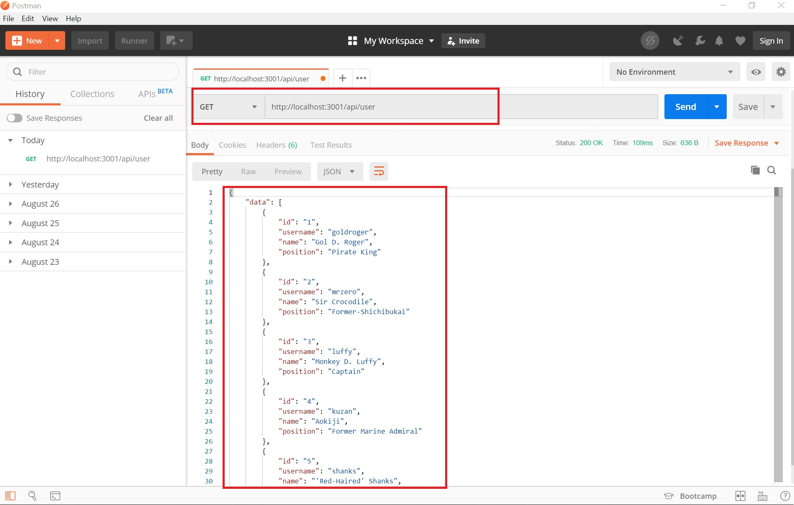

<h1> RESTful-API-Express.js </h1>
RESTful API with Express.js 

<h1>API List</h1>
<table>
    <tr>
        <th>METHOD</th>
        <th>URI</th>
        <th>DESCRIPTION</th>
    </tr>
    <tr>
        <td>GET</td>
        <td>/api/user</td>
        <td>Get all users</td>
    </tr>
    <tr>
        <td>GET</td>
        <td>/api/user/1</td>
        <td>Get user by id</td>
    </tr>
    <tr>
        <td>POST</td>
        <td>/api/user</td>
        <td>Create user</td>
    </tr>
    <tr>
        <td>PUT</td>
        <td>/api/user/1</td>
        <td>Update user</td>
    </tr>
    <tr>
        <td>DELETE</td>
        <td>/api/user/1</td>
        <td>Delete user</td>
    </tr>
</table>

<h1>Example Postman1</h1>

